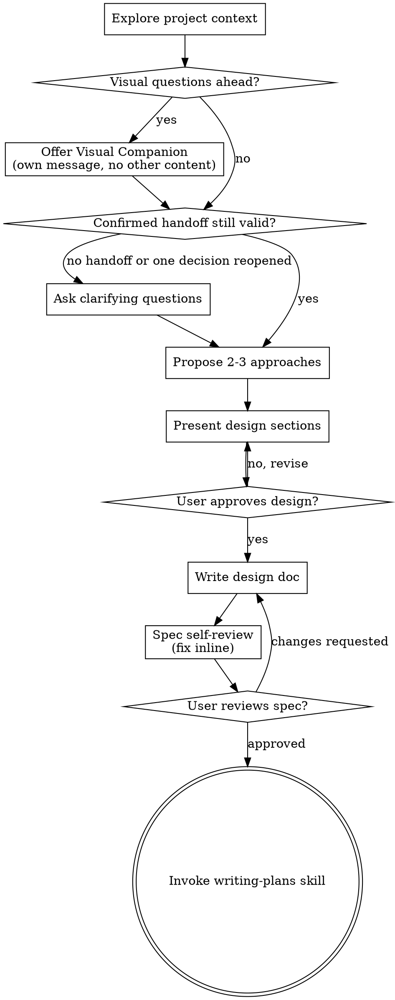

# Brainstorming Ideas Into Designs

Help turn ideas into fully formed designs and specs through natural collaborative dialogue.

Start by deciding whether the request needs the full brainstorming flow. If it does, understand the current project context, then ask questions one at a time to refine the idea. Once you understand what you're building, present the design and get user approval.

<HARD-GATE>
Spec Gate: Do NOT invoke any implementation skill, write any code, scaffold any project, or take any implementation action until you have presented a design and the user has approved it. This applies to every task for which the full brainstorming flow applies.
</HARD-GATE>

## Trigger Policy

Use the full flow for explicit Brainstorming/design-spec/Spec-Gate/full-Superpowers requests, or for costly-to-reverse high-risk work involving architecture or service boundaries, public-contract compatibility, authentication or authorization, persistent data/schema migration, or irreversible external side effects.

High-risk classification takes precedence over clarity or reversibility.

Only when neither explicit opt-in nor a high-risk boundary applies, skip the full flow for clear or readily reversible work regardless of file count, including ordinary behavior changes, button/copy/typo/formatting tweaks, mechanical replacements, small docs/config updates, read-only inspection, command output, or explanations.

If a simple request hides uncertainty affecting architecture, data, integration, test scope, or release behavior, ask one targeted clarification before deciding.

## Confirmed Grilling Handoff

If the conversation contains a confirmed grilling handoff, treat its resolved decisions and delegated defaults as approved input. Skip the clarification stage for those items and do not make grilling a mandatory predecessor.

Do not repeat resolved decisions. Reopen only one decision at a time, and only when its listed reversal evidence appears or its underlying premise is invalidated by new evidence. A merely available alternative or a changed agent preference is not a conflict.

## Repository Spec Profile

For this repository, specs default to infrastructure/workflow design: Superpowers gates, skill/command/hook/rule/agent/tool contracts, failure modes, migration, rollback, fixtures, dry-runs, and verification. Avoid product narrative specs unless explicitly requested.

## Checklist

When this skill applies, you MUST create a task for each of these items and complete them in order:

1. **Explore project context** — check files, docs, recent commits
2. **Offer visual companion** (if task explicitly involves mockups, layouts, wireframes, screenshots, diagrams, or side-by-side visual comparisons) — this is its own message, not combined with a clarifying question. See the Visual Companion section below.
3. **Resolve remaining questions** — skip decisions in a confirmed grilling handoff unless their reversal evidence appears or a premise is invalidated; otherwise ask one at a time
4. **Propose 2-3 approaches** — with trade-offs and your recommendation
5. **Present design** — in sections scaled to their complexity, get user approval after each section
6. **Write design doc** — save to `docs/superpowers/specs/YYYY-MM-DD-<topic>-design.md` using the required template below
7. **Spec self-review** — quick inline check for placeholders, contradictions, ambiguity, scope (see below)
8. **User reviews written spec** — ask user to review the spec file before proceeding
9. **Transition to implementation** — invoke writing-plans skill to create implementation plan

## Process Flow

**The terminal state is invoking writing-plans.** Do NOT invoke frontend-design, mcp-builder, or any other implementation skill. The ONLY skill you invoke after brainstorming is writing-plans.

## The Process

**Understanding the idea:**

- Check out the current project state first (files, docs, recent commits)
- Before asking detailed questions, assess scope: if the request describes multiple independent subsystems (e.g., "build a platform with chat, file storage, billing, and analytics"), flag this immediately. Don't spend questions refining details of a project that needs to be decomposed first.
- If the project is too large for a single spec, help the user decompose into sub-projects: what are the independent pieces, how do they relate, what order should they be built? Then brainstorm the first sub-project through the normal design flow. If estimated scope exceeds 8 major components OR >20 affected files OR >2 weeks estimated effort, automatically propose decomposition into sub-projects with a recommended order and a brief spec for the first sub-project.
- For appropriately scoped projects, ask questions one at a time to refine the idea
- If a confirmed grilling handoff exists, do not repeat resolved decisions; reopen only one at a time, and only when listed reversal evidence appears or an underlying premise is invalidated
- Prefer multiple choice questions when possible, but open-ended is fine too
- Only one question per message - if a topic needs more exploration, break it into multiple questions
- Focus on understanding: purpose, constraints, success criteria

**Exploring approaches:**

- Propose 2-3 different approaches with trade-offs
- Present options conversationally with your recommendation and reasoning
- Lead with your recommended option and explain why

**Presenting the design:**

- Once you believe you understand what you're building, present the design
- Scale each section to its complexity: a few sentences if straightforward, up to 200-300 words if nuanced
- Ask after each section whether it looks right so far
- Cover: architecture, components, data flow, error handling, testing
- Be ready to go back and clarify if something doesn't make sense

**Design for isolation and clarity:**

- Break the system into smaller units that each have one clear purpose, communicate through well-defined interfaces, and can be understood and tested independently
- For each unit, you should be able to answer: what does it do, how do you use it, and what does it depend on?
- Can someone understand what a unit does without reading its internals? Can you change the internals without breaking consumers? If not, the boundaries need work.
- Smaller, well-bounded units are also easier for you to work with - you reason better about code you can hold in context at once, and your edits are more reliable when files are focused. When a file grows large, that's often a signal that it's doing too much.

**Working in existing codebases:**

- Explore the current structure before proposing changes. Follow existing patterns.
- Where existing code has problems that affect the work (e.g., a file that's grown too large, unclear boundaries, tangled responsibilities), include targeted improvements as part of the design - the way a good developer improves code they're working in.
- Don't propose unrelated refactoring. Stay focused on what serves the current goal.

## After the Design

**Documentation:**

- Write the validated design (spec) to `docs/superpowers/specs/YYYY-MM-DD-<topic>-design.md`
  - (User preferences for spec location override this default)
- Use elements-of-style:writing-clearly-and-concisely skill if available
- **Local-only artifact policy:** Treat every generated design spec as a local workflow artifact. Do not stage or commit it. The default `docs/superpowers/` path is ignored.

**Required Spec Template:**

Use the user's language for spec headings. For Chinese projects, use these headings in order: `背景`, `目标`, `非目标`, `需求`, `现有上下文`, `方案对比` with 2-3 options, `推荐方案`, `架构设计`, `组件与文件`, `数据流 / 接口`, `错误处理`, `测试策略`, `验收标准`, `风险与取舍`, `开放问题`.

**Spec Quality Bar:**

- Write an engineering design document, not a loose product memo.
- Make it specific enough for `writing-plans`; do not include implementation checkboxes.
- Include concrete files/interfaces, alternatives, tests, and acceptance criteria.

**Spec Self-Review:**
After writing the spec document, look at it with fresh eyes:

1. **Placeholder scan:** Any "TBD", "TODO", incomplete sections, or vague requirements? Fix them.
2. **Internal consistency:** Do any sections contradict each other? Does the architecture match the feature descriptions?
3. **Scope check:** Is this focused enough for a single implementation plan, or does it need decomposition?
4. **Ambiguity check:** Could any requirement be interpreted two different ways? If so, pick one and make it explicit.

Fix any issues inline. No need to re-review — just fix and move on.

**User Review Gate:**
After the spec review loop passes, ask the user to review the written spec before proceeding:

> "Spec written to `<path>`. Please review it and let me know if you want to make any changes before we start writing out the implementation plan."

Wait for the user's response. If they request changes, make them and re-run the spec review loop. Only proceed once the user has reviewed and approved the saved spec.

**Implementation:**

- Invoke the writing-plans skill to create a detailed implementation plan
- Do NOT invoke any other skill. writing-plans is the next step.

## Key Principles

- **One question at a time** - Don't overwhelm with multiple questions
- **Multiple choice preferred** - Easier to answer than open-ended when possible
- **YAGNI ruthlessly** - Remove unnecessary features from all designs
- **Explore alternatives** - Always propose 2-3 approaches before settling
- **Incremental validation** - Present design, get approval before moving on
- **Be flexible** - Go back and clarify when something doesn't make sense

## Visual Companion

A browser-based companion for showing mockups, diagrams, and visual options during brainstorming. Available as a tool — not a mode. Accepting the companion means it's available for questions that benefit from visual treatment; it does NOT mean every question goes through the browser.

**Offering the companion:** When you anticipate that upcoming questions will involve visual content (mockups, layouts, diagrams), offer it once for consent:

> "Some of what we're working on might be easier to explain if I can show it to you in a web browser. I can put together mockups, diagrams, comparisons, and other visuals as we go. This feature is still new and can be token-intensive. Want to try it? (Requires opening a local URL)"

**This offer MUST be its own message.** Do not combine it with clarifying questions, context summaries, or any other content. The message should contain ONLY the offer above and nothing else. Wait for the user's response before continuing. If they decline, proceed with text-only brainstorming.

If the user does not respond within 48 hours or a configured timeout, proceed with text-only brainstorming and note that the Visual Companion was not accepted.

**Per-question decision:** Even after the user accepts, decide FOR EACH QUESTION whether to use the browser or the terminal. The test: **would the user understand this better by seeing it than reading it?**

- **Use the browser** for content that IS visual — mockups, wireframes, layout comparisons, architecture diagrams, side-by-side visual designs
- **Use the terminal** for content that is text — requirements questions, conceptual choices, tradeoff lists, A/B/C/D text options, scope decisions

A question about a UI topic is not automatically a visual question. "What does personality mean in this context?" is a conceptual question — use the terminal. "Which wizard layout works better?" is a visual question — use the browser.

If they agree to the companion, read the detailed guide before proceeding:
`skills/brainstorming/visual-companion.md`
